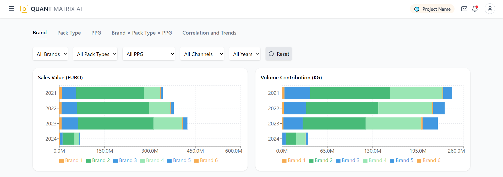
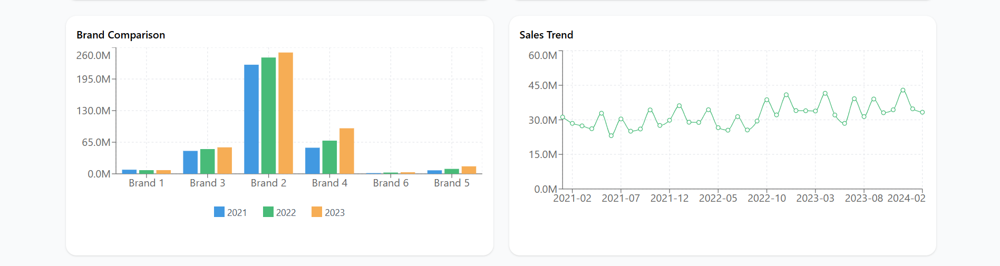
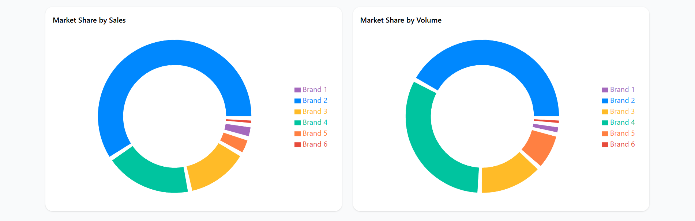

# EDA App Dashboard 

The **EDA App Dashboard** is a React + Vite project that provides **interactive Exploratory Data Analysis** on sales data.  
It helps users visualize sales trends, compare brands, and filter data by multiple parameters.





---

## Charts & Visualizations

### Charts
- **Horizontal Bar Chart (Sales Value by Year):** Displays total sales value for each brand across different years.  
- **Horizontal Bar Chart (Volume in kg):** Shows total product volume sold over time.  
- **Vertical Bar Chart (Year-wise Sales Value):** Compares sales value of brands year by year.  
- **Line Chart (Monthly Trend of Sales Value):** Visualizes how sales value changes month to month.  

### Contribution Charts
- **Pie/Donut Chart (Market Share by Sales/Volume):** Shows percentage contribution of brands or categories with clear legends and distinction between values.  

### Additional Features
- Interactive filters for Brand, Pack Type, PPG, Channel, and Year.  
- Hoverable tooltips to show exact values on charts.

---

## Technologies Used

- **Frontend:** React, Vite, Tailwind CSS, Chart.js
- **Backend:** Django + Django REST Framework
- **API Calls:** Axios
- **State Management:** React Hooks

---

## Getting Started

1. **Clone the repository**

```bash
git clone https://github.com/Ansh86/EDA_Frontend.git
